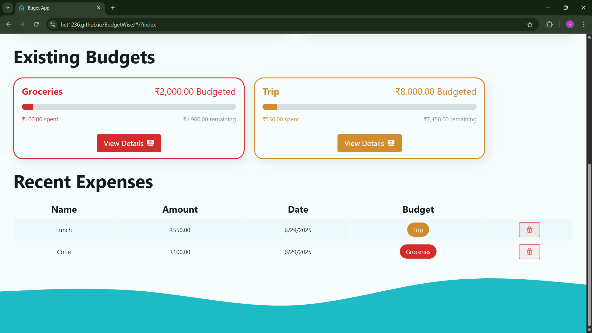

# 💼 BudgetWise – Final Project Report


**Prepared by:** Het Patel  
**Date:** June 2025

## Table of Contents

- [1. Introduction](#1-introduction)
- [2. Project Objectives](#2-project-objectives)
- [3. Technology Stack](#3-technology-stack)
- [4. System Architecture](#4-system-architecture)
- [5. Features Overview](#5-features-overview)
- [6. User Experience & UI](#6-user-experience--ui)
- [7. Routing & Code Structure](#7-routing--code-structure)
- [8. Data Management](#8-data-management)
- [9. Testing & Quality Assurance](#9-testing--quality-assurance)
- [10. Deployment](#10-deployment)
- [11. Screenshots & Demo](#11-screenshots--demo)
- [12. Challenges & Learnings](#12-challenges--learnings)
- [13. Future Scope](#13-future-scope)
- [14. Conclusion](#14-conclusion)
- [15. Acknowledgments](#15-acknowledgments)

---

## 1. Introduction

**BudgetWise** is a modern, responsive web application designed to help users manage personal budgets and expenses efficiently. Built with React and Vite, it offers a seamless user experience, robust data handling, and clear financial visualization—all within the browser.

---

## 2. Project Objectives

- Enable users to create, manage, and delete multiple budgets.
- Allow categorization and tracking of expenses.
- Provide visual insights into spending habits.
- Ensure data privacy by storing all information locally.
- Deliver a clean, intuitive, and responsive UI.

---

## 3. Technology Stack

- **Frontend:** React, Vite, React Router DOM
- **Styling:** CSS, SVG
- **Notifications:** React Toastify
- **Data Persistence:** LocalStorage
- **Deployment:** GitHub Pages

---

## 4. System Architecture

- **Component-Based:** Modular React components for scalability and maintainability.
- **Routing:** Nested routes using React Router for dashboard, budgets, expenses, and error handling.
- **State Management:** Local state and browser localStorage for persistence.
- **Actions & Loaders:** Data fetching and mutation handled via route loaders and actions.

---

## 5. Features Overview

- **User Onboarding:** Simple, guided introduction for first-time users.
- **Budgets:** Create unlimited budgets with custom names and limits.
- **Expenses:** Add expenses, assign to budgets, and categorize.
- **Dashboard:** Overview of all budgets, spending progress, and quick actions.
- **Expense Table:** Detailed view of all expenses with filtering.
- **Budget Details:** Drill-down into individual budgets and their expenses.
- **Data Persistence:** All data stored securely in browser localStorage.
- **Notifications:** Real-time feedback for user actions.
- **Error Handling:** Friendly error pages for navigation and data issues.

---

## 6. User Experience & UI

- **Responsive Design:** Works seamlessly on desktop and mobile.
- **Visual Feedback:** Progress bars, charts, and toast notifications.
- **Accessibility:** Keyboard navigation and semantic HTML.
- **Branding:** Custom logo, color palette, and SVG illustrations.

---

## 7. Routing & Code Structure

**Routing Example (from `App.jsx`):**
```jsx
let router = createHashRouter([
  {
    path: "/",
    element: <Main/>,
    loader: mainLoader,
    errorElement: <Error/>,
    children: [
      {
        index: true,
        path: "/",
        element: <Dashboard/>,
        loader: dashboardLoader,
        action: dashboardAction,
        errorElement: <Error/>
      },
      {
        path: "budget/:id",
        element: <BudgetPage/>,
        loader: budgetLoader,
        action: budgetAction,
        errorElement: <Error/>,
        children: [
          { path: "delete", action: deleteBudget }
        ]
      },
      {
        path: "expenses",
        element: <ExpensesPage/>,
        loader: expensesLoader,
        action: expensesAction,
        errorElement: <Error/>
      },
      {
        path: "/logout",
        action: logoutAction,
        errorElement: <Error/>
      },
      {
        path: "/about",
        element: <h1>About</h1>,
        errorElement: <Error/>
      }
    ]
  },
  {
    path: "*",
    errorElement: <Error/>
  }
]);
```

**Directory Structure:**
```
src/
 ┣ actions/
 ┣ assets/
 ┣ components/
 ┣ layouts/
 ┣ pages/
 ┣ App.jsx
 ┣ helpers.js
 ┣ index.css
 ┣ main.jsx
```

---

## 8. Data Management

- **LocalStorage:** All budgets and expenses are stored in the browser, ensuring privacy and offline access.
- **Helpers:** Utility functions for CRUD operations on budgets and expenses.
- **Actions/Loaders:** Used for data fetching and mutations in route-based components.

---

## 9. Testing & Quality Assurance

- **Manual Testing:** All user flows tested across Chrome, Firefox, and Edge.
- **Responsiveness:** Verified on multiple screen sizes.
- **Error Handling:** Simulated error states for robust user experience.
- **Code Quality:** Modular, reusable components and clear separation of concerns.

---

## 10. Deployment

- **Build Tool:** Vite for fast builds and hot reloading.
- **Hosting:** Deployed on GitHub Pages.
- **Deployment Steps:**
  ```bash
  npm run build
  npm run deploy
  ```
- **Live Demo:** [BudgetWise Live](https://het1236.github.io/BudgetWise/)

---

## 11. Screenshots & Demo

| **Starting Page** | **Dashboard View** |
|-------------------|-------------------|
|  |  |

| **Budget Card** | **All Expenses** |
|-----------------|------------------|
|  |  |

**Demo Video:**  
[](https://drive.google.com/file/d/1XqLxch3LhEmqxVsRD7MaHs9nlLmD8wFC/view?usp=drive_link)

---

## 12. Challenges & Learnings

- **Routing Complexity:** Implementing nested routes and error boundaries for a seamless experience.
- **State Persistence:** Ensuring data integrity with localStorage and React state.
- **UI Consistency:** Maintaining a clean, accessible, and responsive design.
- **Feedback Loops:** Providing instant feedback for all user actions.

---

## 13. Future Scope

- Export budget reports as PDF/CSV.
- Date-based filtering and analytics.
- Advanced charts and graphs for spending insights.
- User authentication and cloud sync (Firebase).
- Multi-device support and PWA features.

---

## 14. Conclusion

BudgetWise demonstrates a practical, user-centric approach to personal finance management using modern web technologies. The project showcases skills in React, state management, UI/UX design, and deployment best practices.

---

## 15. Acknowledgments

Special thanks to my internship mentors, the open-source community, and design inspiration from Dribbble, Tailwind UI, and GitHub Projects.

---

**Prepared by:**  
Het Patel  
June 2025
