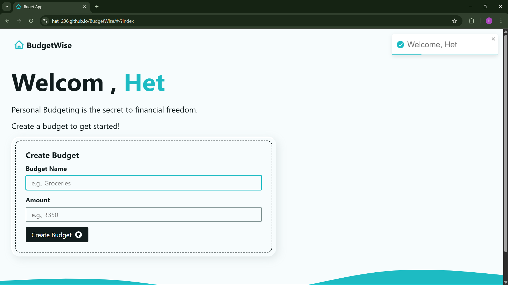
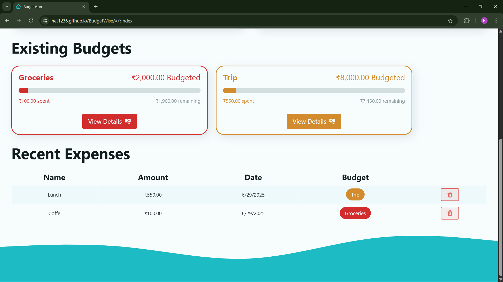
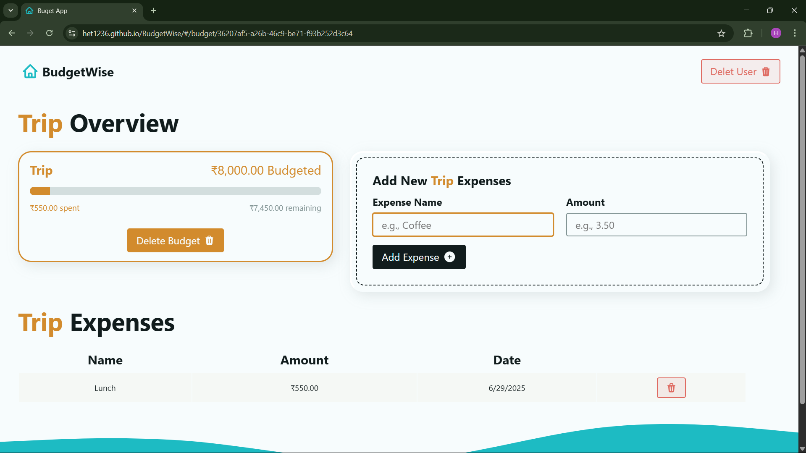
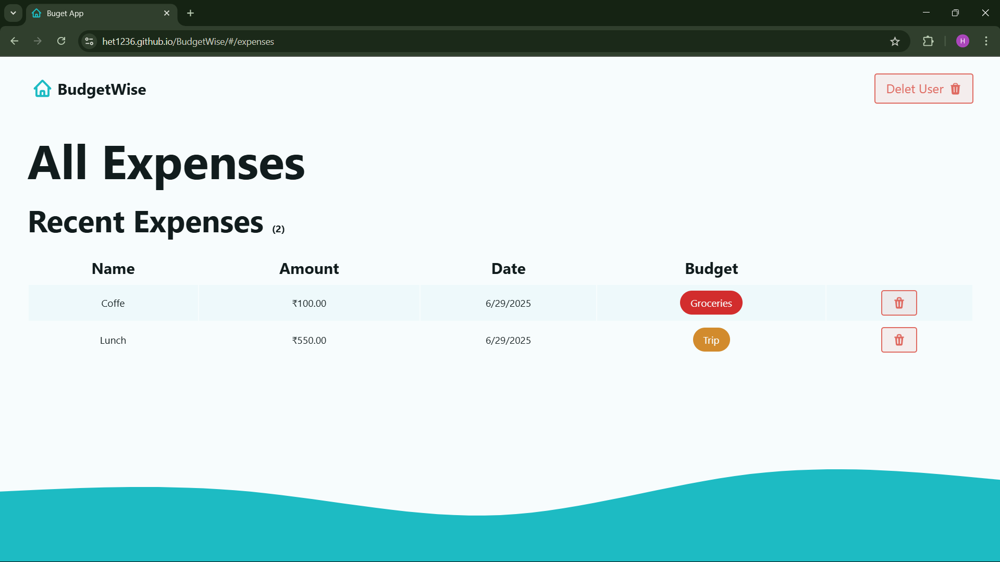

# 💰 BudgetWise – Smart Personal Budget & Expense Manager

[](https://het1236.github.io/BudgetWise/)
[](./LICENSE)


A beginner-friendly, responsive budgeting web app created using **React**, **Vite**, and **React Router**. It empowers users to manage multiple budgets, track categorized expenses, and visualize financial data — all stored locally in the browser.

---

## 🧭 Table of Contents

- [🌟 Features](#-features)
- [🎯 Project Overview](#-project-overview)
- [🚀 Live Demo](#-live-demo)
- [🖼️ Screenshots](#-screenshots)
- [📁 Project Structure](#-project-structure)
- [🛠️ Technologies Used](#-technologies-used)
- [📥 Installation](#-installation)
- [🌐 Deployment](#-deployment)
- [📈 Future Scope](#-future-scope)
- [📄 License](#-license)
- [🙌 Acknowledgments](#-acknowledgments)

---

## 🌟 Features

- 🎉 Clean user onboarding
- 🧾 Add unlimited budgets with custom names
- 📂 Add expenses with category mapping
- 📊 Progress bars for visual spending overview
- 🔍 Navigate to personal budget views with filtered expenses
- 🧹 One-click delete for budgets or entire user session
- 💾 All data stored securely in browser via `localStorage`
- 📥 **Download Report (Coming Soon)**

---

## 🎯 Project Overview

Built as part of a professional internship submission, this app aims to solve real-life budgeting problems using minimal tech and maximum UI clarity.

---

## 🚀 Live Demo

👉 [Click here to launch BudgetWise](https://het1236.github.io/BudgetWise/)

---

## 🖼️ Screenshots

All screenshots are stored inside `src/assets/` and embedded below.

| 📍 Starting Page | 📊 Dashboard View |
|------------------|------------------|
|  |  |

| 📂 Budget Card | 🧾 All Expenses |
|----------------|------------------|
|  |  |

🎥 **Demo Video:** [Watch Demo](https://drive.google.com/file/d/1XqLxch3LhEmqxVsRD7MaHs9nlLmD8wFC/view?usp=drive_link)

---

## 📁 Project Structure

```
src/
 ┣ 📁 actions/               # JS functions like logout, deleteBudget
 ┣ 📁 assets/                # All images, icons, screenshots, demo videos
 ┣ 📁 components/            # Reusable UI elements (forms, cards, nav)
 ┣ ┃ ┣ AddBudgetForm.jsx
 ┃  ┣ AddExpenseForm.jsx
 ┃  ┣ BudgetItem.jsx
 ┃  ┣ ExpenseItem.jsx
 ┃  ┣ Intro.jsx
 ┃  ┣ Nav.jsx
 ┃  ┗ Table.jsx
 ┣ 📁 layouts/               # Main layout wrappers
 ┣ 📁 pages/                 # Page-specific routing views
 ┣ App.jsx                  # Main routing entry
 ┣ index.css                # Global styles
 ┣ main.jsx                 # Entry point to React DOM
 ┣ helpers.js               # Custom logic and utils
```

---

## 🛠️ Technologies Used

- ⚛️ **React** – UI library
- ⚡ **Vite** – Blazing fast build tool
- 🔁 **React Router DOM** – Routing and navigation
- 💬 **React Toastify** – User notifications
- 🎨 **CSS & SVG** – UI Styling and illustrations
- 📦 **LocalStorage** – Frontend data persistence
- 🌍 **GitHub Pages** – Deployed static site

---

## 📥 Installation

```bash
git clone https://github.com/Het1236/BudgetWise.git
cd BudgetWise
npm install
npm run dev
```

---

## 🌐 Deployment

Ensure `vite.config.js` contains:

```js
base: "/BudgetWise/"
```

Then deploy with:

```bash
npm run build
npm run deploy
```

App is now live at:  
🔗 `https://het1236.github.io/BudgetWise/`

---

## 📈 Future Scope

- 📤 Export budget reports as PDF/CSV
- 🗓️ Date filters for budgeting
- 📊 Advanced charts and graphs
- 👥 User login system (Firebase)
- ☁️ Cloud data sync

---

## 📄 License

This project is licensed under the [MIT License](./LICENSE).
---

## 🙌 Acknowledgments

Thanks to the open-source community, my internship mentors, and design inspiration from platforms like Dribbble, Tailwind UI, and GitHub Projects.
